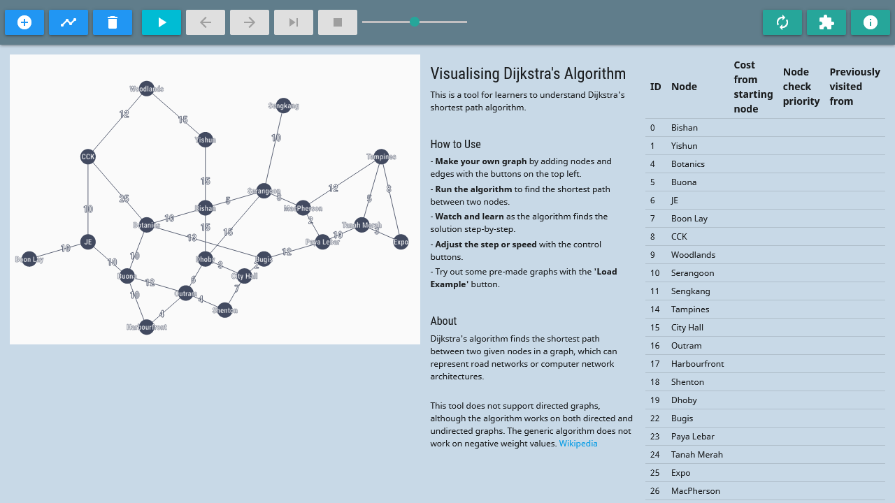

# Visualisation of Dijkstra's Shortest Path Algorithm (TypeScript)  

A web application for a school project - Development of a Software Application for Teaching Computer Networking.

## What is this?
The application is a tool to help students visualise how Dijkstra's algorithm runs.

Dijkstra's algorithm finds the lowest-cost (or shortest) path between two points in a network, and variants of it are used widely in maps, internet networking, finding cheapest costs of a flight, etc. See [the Wikipedia article](https://en.wikipedia.org/wiki/Dijkstra%27s_algorithm) for more information.

This application lets you:
- Create your own graph networks
- Calculate the best (lowest cost) path between two points in the network
- Watch the algorithm work it out step-by-step, with explanations

[Try out the application here](https://tanxh33.github.io/visualise-dijkstra-ts/).



Project report permalink: https://hdl.handle.net/10356/149518

---
## About the code
This is a mildly refactored version of [this existing repo](https://github.com/tanxh33/visualise-dijkstra), which was written with plain JavaScript.

This version is built with [TypeScript](https://www.typescriptlang.org/) and [MaterializeCSS](https://materializecss.com/).

Code for weighted graph implemented with reference to this article by Maiko Miyazaki: [Completed JavaScript Data Structure Course, and Here is What I Learned About Graph (+ Dijkstra Algorithm)](https://dev.to/maikomiyazaki/completed-javascript-data-structure-course-and-here-is-what-i-learned-about-graph-dijkstra-algorithm-57n8).

---
## Compilation
Install development packages. Note that parcel-bundler v1.12.4 has problems when trying to run or compile.
```
npm install
```

Run parcel-bundler in development mode to continuously watch the entry file `./src/index.ts` so that it will re-compile when changes are made. You may or may not encounter an error if you have whitespaces in your absolute file path.
```
npm run dev
```

Compile TypeScript files into JavaScript for production. The compiled files are set to go into the `./js` folder.
```
npm run build
```

After either of these, you will be able to open and view the index.html file. For convenience, I use [VSCode's Live Server](https://marketplace.visualstudio.com/items?itemName=ritwickdey.LiveServer) extension.

---
## What else can be done
- Refactoring:
  - Better compartmentalisation and organisation of code, more reusability
  - Remove redundant loops / checks / data structures
- Improving usability:
  - Randomly generated graphs
  - Undo / Redo actions
  - Drag-and-drop elements
  - Zoom in / out of canvas
  - Support directed graphs
  - Save and load graphs (maybe with `localStorage`?)


---
Tested on Firefox version 86.0 and Chrome version 89.0.4389.82.
